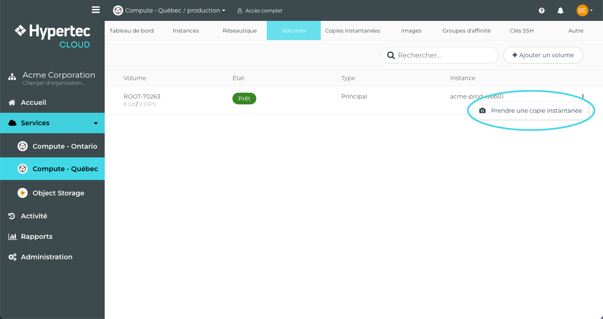
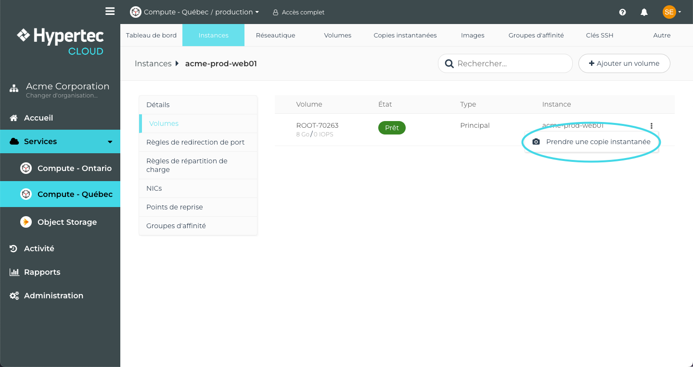
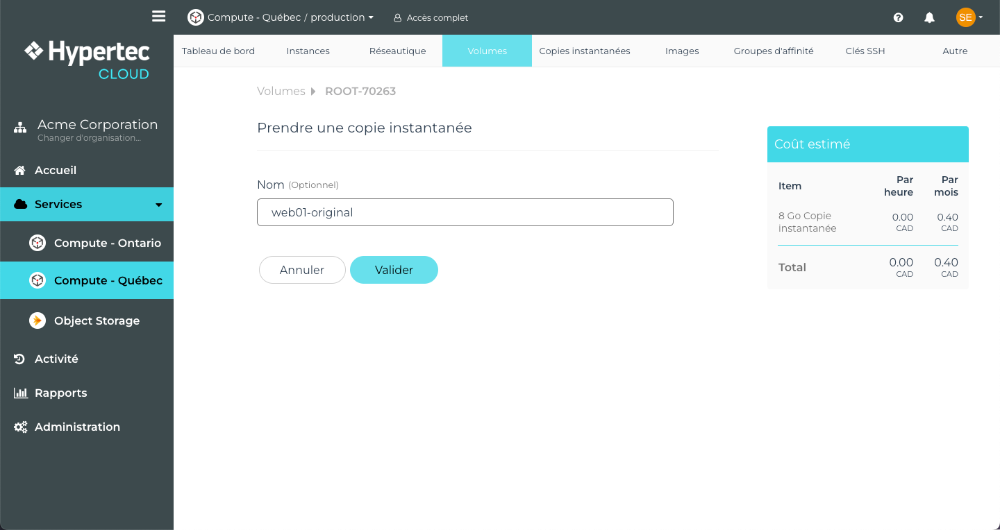

Un volume dans Hypertec Cloud peut être utilisé pour créer une **copie instantanée**, qui est une copie statique de ce disque et de tout son contenu au moment où la copie instantanée a été prise. Cela peut être utile dans plusieurs scénarios :
   - Restauration : lorsque vous testez les modifications apportées à une instance et qu'une erreur se produit, l'instance peut être redéployée à partir d'une copie instantanée prise juste avant la modification, essentiellement en ramener l'instance à un état correct.
   - Image maître : une instance peut être configurée dans un état souhaité et une copie instantanée peut être utilisé pour provisionner un [modèle d'instance](working-with-instance-templates.md) à utiliser pour déployer plusieurs instances.
   - Dépannage : si le dépannage d'une instance est nécessaire, une copie instantanée peut être prise et utilisée pour créer une instance identique en dehors de l'environnement de production.

Les volumes de genres **root** et **data** peuvent être utilisés pour créer une copie instantanée. Les copies instantanées sont stockées dans un stockage d'objets à l'échelle de la région, ce qui les rend disponibles pour une utilisation dans plusieurs zones. <!-- Take out for standard KB -->

Les copies instantanées existantes sont accessibles en naviguer à l'environnement souhaité et en cliquant sur l'onglet **Copies instantanées**.

**Avis :** Une copie instantanée n'est pas destinée à être une sauvegarde d'une instance.

### Créer un instantané à partir d'un volume

1. Une copie instantanée peut être créée à partir d'un volume répertorié dans l'onglet **Volumes** d'un environnement, à partir d'un volume sur la page de détails d'une instance, sous l'élément **Volumes**, ou en cliquant sur *Ajouter une copie instantanée* sur l'onglet **Copies instantanées**.
    - Depuis l'onglet **Volumes** :
       - 
    - Depuis la page de détails d'une instance :
       - 
1. Pour créer la copie instantanée, cliquez sur le menu *Action* à droite du volume, et sélectionnez *Prendre une copie instantanée*. La page *Prendre une copie instantanée* apparaîtra :
    - 
1. Vous pouvez choisir de fournir un nom pour la copie instantanée, ou si le champ est laissé vide, Hypertec Cloud générera automatiquement un nom. Vous pouvez également choisir d'en faire une **copie instantanée rapide**, voir ci-dessous pour plus de détails.
1. Cliquez sur *Valider* pour créer la copie instantanée.
1. L'onglet **Volumes** apparaîtra et le volume choisi pour la copie instantanée sera dans l'état **En cours de copie instantanée**.
1. Cliquez sur l'onglet **Copies instantanés**. La nouvelle copie instantanée apparaîtra dans l'état **Sauvegarde en cours**. Lorsque la copie instantanée est terminée, elle apparaîtra dans l'état **Sauvegardé**.

### Supprimer une copie instantanée

1. Accédez à l'onglet **Copies instantanées** dans l'environnement approprié.
1. Cliquez sur le menu **Action** à droite de la copie instantanée, puis cliquez sur *Supprimer*.
1. Une boîte de dialogue apparaîtra demandant une confirmation. Cliquez sur *Valider*.
1. La copie instantanée entrera dans l'état **Suppression**, et lorsque la suppression termine, la copie instantanée sera supprimée de l'onglet **Copies instantanées**.

### Copies instantanées rapides

Une **copie instantanée rapide** peut être créée en sélectionnant l'option *Copie instantanée rapide* lors de la création d'une copie instantanée. Les copies instantanées rapides apparaissent immédiatement sur la page **Copies instantanées** et sont marquées d'une coche dans la colonne **Rapide**. Dès qu'elle est disponible, une copie instantanée rapide peut être utilisée comme n'importe quel autre copie instantanée. À cause de qu'une copie instantanée rapide utilise des ressources supplémentaires, elle sera automatiquement archivée après 24 heures, après quoi elle devient une copie instantanée normale.
